# Strain Co-Scientist

A TypeScript **Electron desktop application** that implements the multi-agent
**Co-Scientist** architecture (Gottweis et al., *Nature* 2026), adapted from
biomedical hypothesis generation to the **rational engineering of industrial
microbial strains**. Give it a product target, a host, and constraints; a team
of specialized agents then generates, peer-reviews, debates, ranks, evolves, and
synthesizes concrete strain-design strategies — with a clean, professional
monitoring & management UI.

> Not a web service. A self-contained desktop workstation that stores everything
> locally.

---

## What it does

Given a strain-engineering goal (e.g. *"increase mevalonate titer in E. coli"*),
the system runs an asynchronous, self-improving loop that produces a ranked set
of **strain designs**, each with:

- concrete **interventions** (knockouts, overexpression, knockdowns, promoter/RBS
  tuning, heterologous pathways, transporter/cofactor engineering, dynamic
  regulation, enzyme engineering),
- a mechanistic rationale and predicted effect on titer/rate/yield,
- a **Design-Build-Test-Learn (DBTL)** experimental plan,
- construct/primer suggestions,
- risk and biosafety assessment,
- literature citations and an Elo-based quality ranking,
- and a synthesized **research overview** (engineering roadmap) for the scientist.

## Architecture — faithful to the paper, retargeted to strain engineering

Four components from the Co-Scientist paper:

1. **Natural-language I/O** — campaigns + an expert-in-the-loop surface.
2. **Asynchronous task framework** — a Supervisor manages a bounded-concurrency
   worker queue of agent tasks (`src/main/engine/TaskQueue.ts`,
   `src/main/engine/Supervisor.ts`).
3. **Specialized agents** (`src/main/engine/agents/`):
   - **Generation** — literature exploration, simulated scientific debate,
     assumption decomposition, research expansion.
   - **Reflection** — initial / full / deep-verification / observation /
     simulation / tournament reviews, with a biosafety gate.
   - **Ranking** — Elo tournament (init 1200) via pairwise scientific-debate
     matches (`src/main/engine/tournament/Elo.ts`).
   - **Proximity** — similarity graph + clustering for de-dup and match
     selection.
   - **Evolution** — six refinement strategies; always creates *new* designs
     that must re-earn their rank.
   - **Meta-review** — synthesizes recurring critique into per-agent feedback
     (improvement without backprop) and produces the final research overview.
4. **Persistent context memory** — atomic JSON store under Electron `userData`
   (`src/main/memory/Store.ts`); runs survive restarts.

The DBTL experiment loop is drawn from *Robin* (Ghareeb et al., *Nature* 2026),
and the scientist-in-the-loop "collaborator" framing from the biomedical AI
agents review (2024).

### Closing the loop — experimental-results feedback (DBTL "Learn")

The wet-lab path is **closed**, not just flagged. The scientist records an
`ExperimentalResult` (outcome + measured-vs-baseline value + observations)
against any design, and it flows back through the whole engine:

- **Authoritative evidence grade** — a design's results derive an evidence grade
  (`measured-confirmed > measured-partial > predicted-only > measured-refuted`)
  that is the top-level ranking key (`compareDesigns`): a design that *worked in
  the lab* always outranks one that merely argues well, while Elo still orders
  the unmeasured frontier. The Elo math is untouched, so the deterministic
  ladder replay is preserved — measured outcomes enter only as a pure function
  of persisted data.
- **Anchored reasoning** — measured results are injected into tournament match
  prompts as decisive evidence, drive a dedicated **calibration** review mode,
  and seed an **empirical-refinement** evolution strategy + campaign-level priors
  (amplify what worked, avoid what failed).
- **Prediction calibration** — each design commits to a structured
  `QuantPrediction`; a per-cycle `CalibrationProfile` (signed bias, MAE,
  Spearman, Brier, per-intervention-class bias) feeds back into agent prompts so
  the system measurably learns to predict better.
- **Asynchronous re-opening** — results recorded weeks later on a terminated
  campaign re-open it for a results-informed cycle (`reopenCampaign`); a
  campaign won't terminate while there's unprocessed lab data.

See `src/main/engine/learn/Calibration.ts` and the `Experiments` view.

### Tech stack

- Electron + electron-vite, TypeScript end-to-end.
- React 18 + Zustand (renderer); custom CSS design system (no UI framework).
- `@anthropic-ai/sdk` (default LLM) with a tiered model strategy:
  **Opus 4.8** (`claude-opus-4-8`) for Generation/Reflection/Meta-review,
  **Sonnet 4.6** (`claude-sonnet-4-6`) for Ranking/Proximity/Evolution.
  All per-agent models are configurable in Settings. An OpenAI-compatible
  adapter is also included.
- `@modelcontextprotocol/sdk` streamable-HTTP client for grounding.
- `d3-force` for the proximity map; all other charts are hand-rolled SVG.

## Grounding via MCP (optional)

In **Settings → Grounding**, connect either or both servers (with a
*Test connection* button):

- **deep-research** (`/api/mcp`, streamable-http) — literature grounding for the
  Generation, Reflection, and Evolution agents.
- **CodeXomics** (`http://localhost:3002`) — gene existence/sequence checks,
  BLAST/UniProt/AlphaFold/pathway context, and primer/construct design.

When a server is unreachable, the corresponding agent step degrades gracefully
(the design is annotated rather than failing).

## Running

```bash
npm install
npm run dev          # launch the desktop app (electron-vite dev)
npm run build        # type-check-clean production build into ./out
npm run dist         # package an installer (electron-builder)
npm run typecheck    # tsc for both node and web projects
```

The agents call a live LLM. Open **Settings**, add an Anthropic API key (and,
optionally, the deep-research / CodeXomics MCP servers for grounding) before
running a campaign.

---

## Using Strain Co-Scientist

### Step 1 — Configure

Open **Settings** before running anything.

**Providers** — enable at least one LLM provider and paste your API key.
Anthropic (Claude) and DeepSeek are both supported out of the box; an
OpenAI-compatible shim handles any other provider.

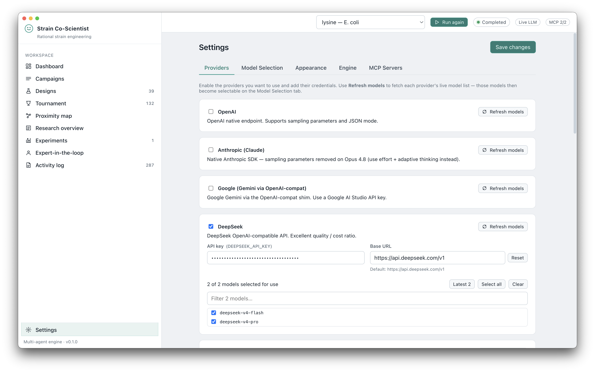

**Model Selection** — choose the high-tier model (Generation / Reflection /
Meta-review) and the fast-tier model (Ranking / Proximity / Evolution). The
defaults (`claude-opus-4-8` / `claude-sonnet-4-6`) give the best results;
per-agent overrides are available for cost control.

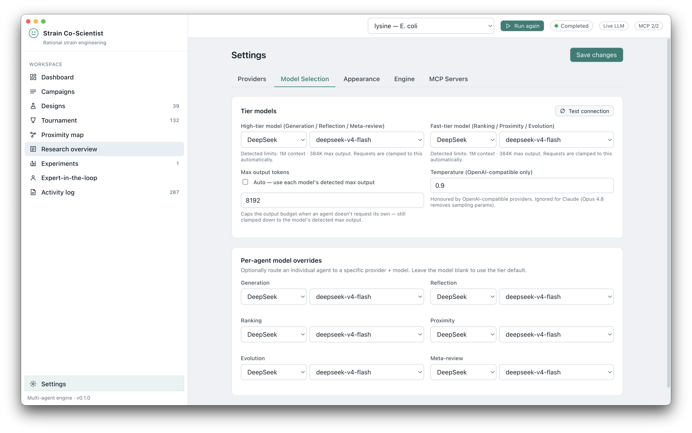

**MCP Servers** *(optional)* — connect the **Deep Research** server for
literature grounding and **CodeXomics** for genomic data, BLAST, and construct
design. Both degrade gracefully when unreachable.

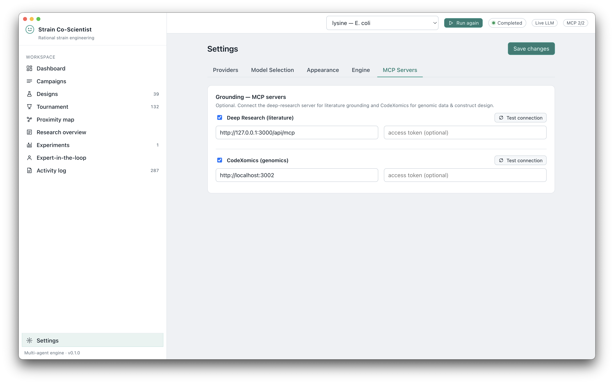

---

### Step 2 — Create a campaign

Go to **Campaigns → + New campaign**. Set:
- **Product** — the target molecule (e.g. *lysine*, *mevalonate*)
- **Host** — the production organism (e.g. *E. coli*, *C. glutamicum*)
- **Objective** — what to optimise (titer / rate / yield)
- **Constraints** — budget, safety level, forbidden interventions
- **Compute budget** — number of agent cycles (more cycles = deeper search)

Hit **Run**. The campaign is saved locally and survives restarts.

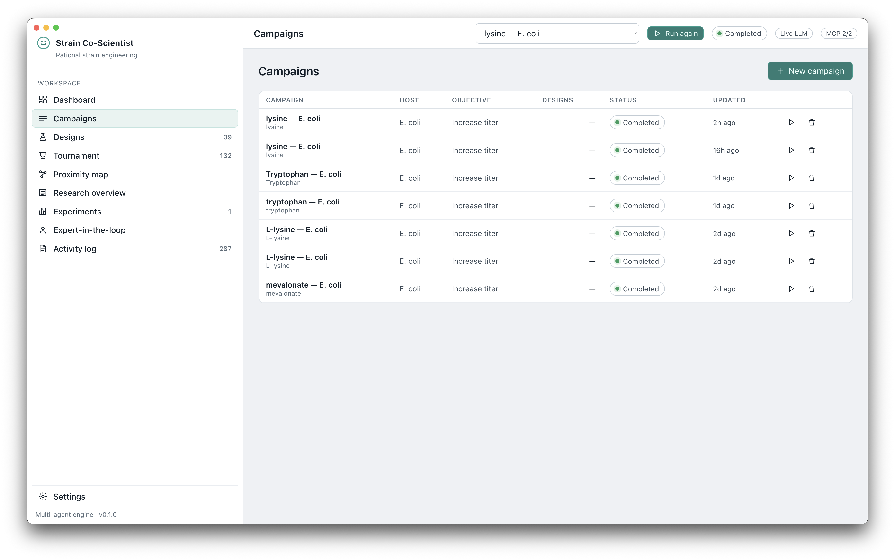

---

### Step 3 — Monitor progress

The **Dashboard** shows the full system state in real time: the Elo-over-compute
chart (test-time scaling), strategy effectiveness (Generation vs. Evolution
win-rates), agent utilisation across the worker queue, designs-by-status
breakdown, and the DBTL evidence standing (confirmed / partial / refuted counts).

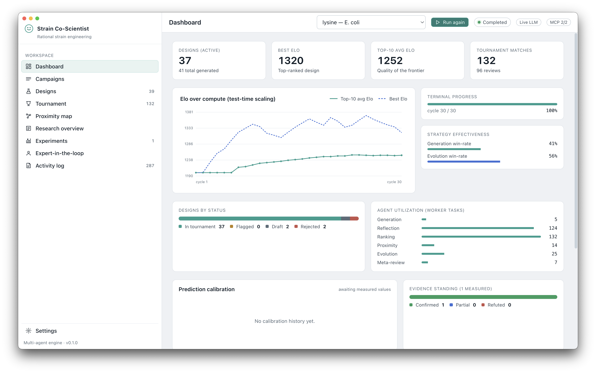

The **Activity log** streams every structured agent event — filter by agent role
or severity to track what the system is doing at any moment.

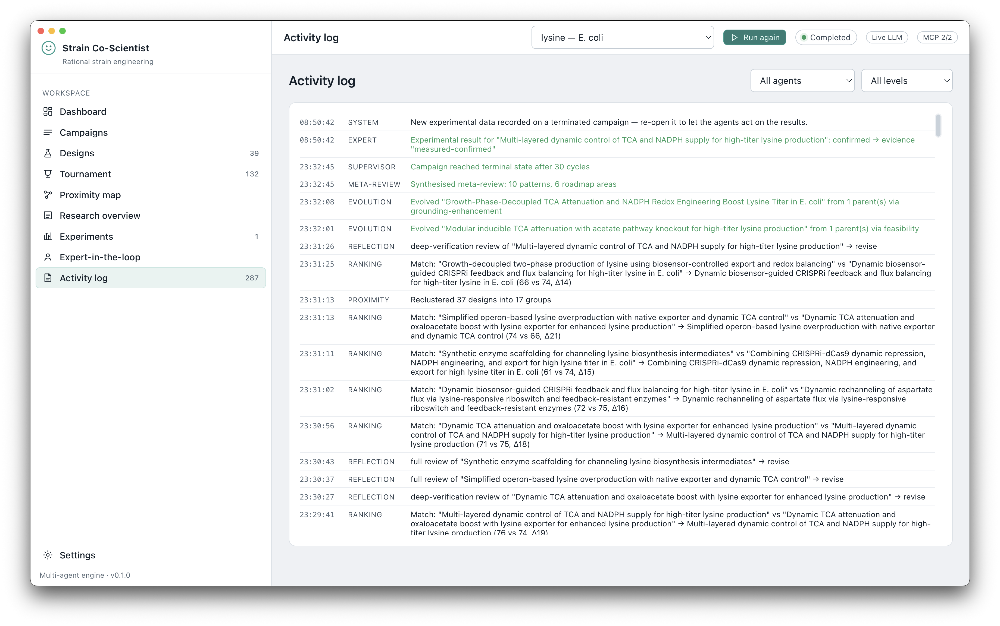

---

### Step 4 — Explore the design space

**Designs** lists every generated strategy in evidence-then-Elo order: a design
confirmed in the lab always ranks above the predicted-only frontier regardless of
Elo. The "Confirmed in lab" badge marks lab-verified winners.

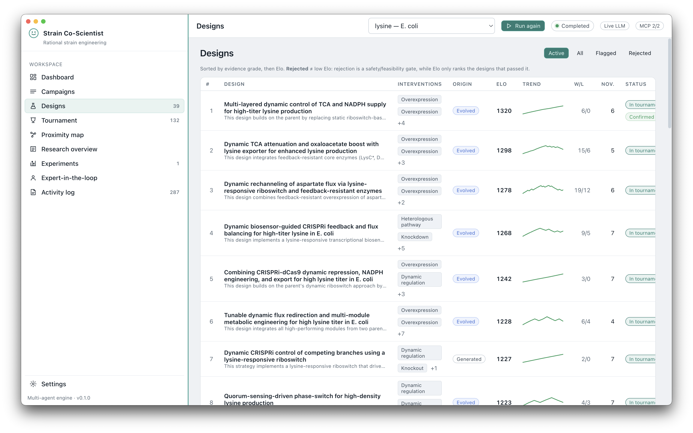

Click any row to open the **design drawer**, which shows the full intervention
list, mechanistic rationale, DBTL experimental plan, construct and primer
suggestions, risk assessment, all agent reviews, and an Elo sparkline.

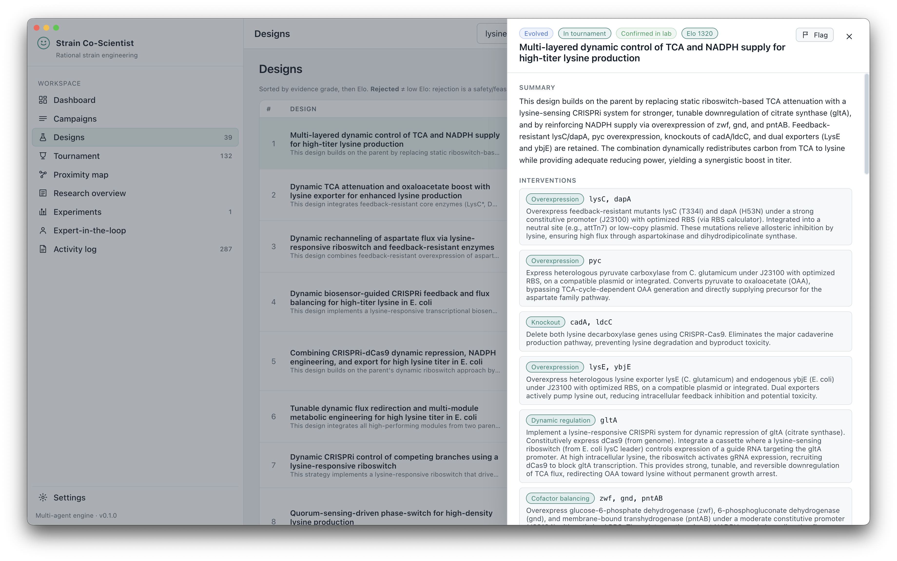

**Tournament** shows every Elo match as a side-by-side scientific debate. Expand
any match to read the full transcript and scoring rationale.

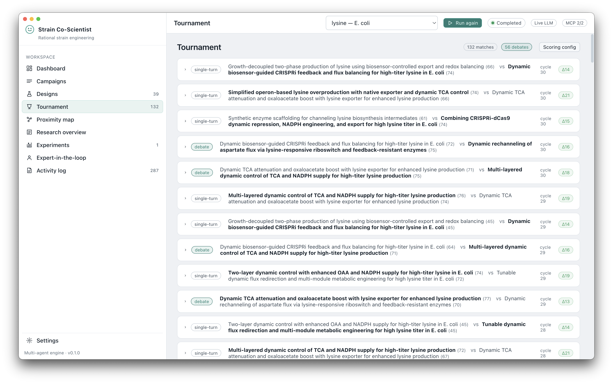

**Proximity map** renders the explored design space as a d3-force cluster
graph. Node size = Elo; colour = cluster. Click any node to inspect the design.

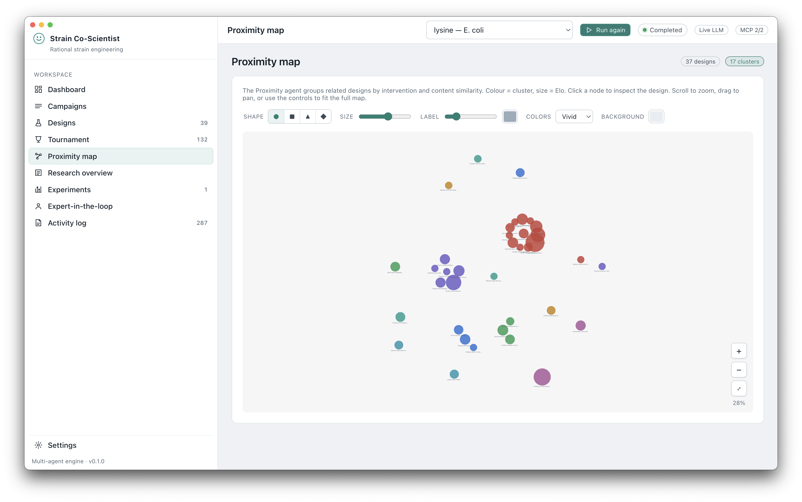

**Research overview** is the Meta-review agent's synthesis: an engineering
roadmap, recurring critique patterns, and suggested collaborators — updated each
cycle.

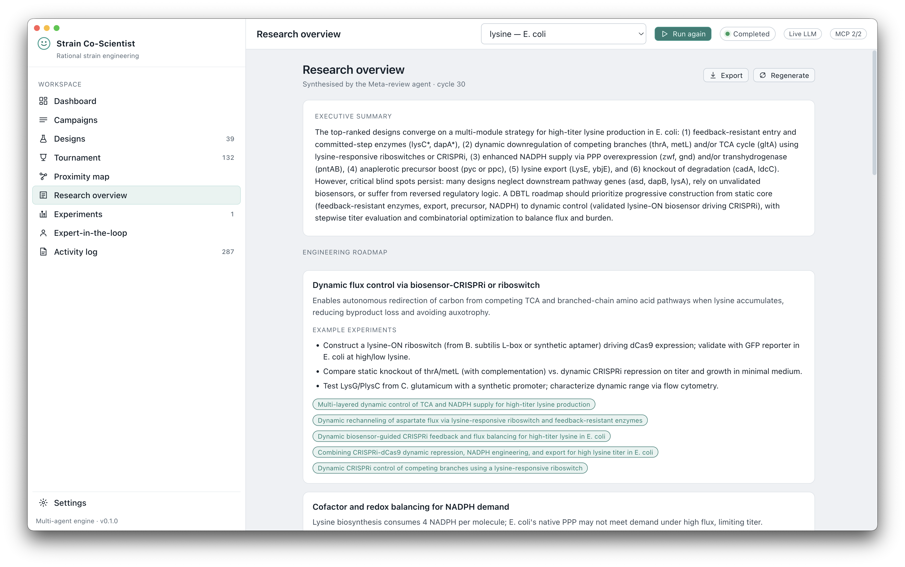

---

### Step 5 — Record wet-lab results (DBTL Learn)

Scroll to the bottom of the design drawer and fill in **Record a result**:
choose the outcome (confirmed / partial / refuted), enter the measured value and
baseline, and add observations. Submit, and the result flows back through the
full engine immediately.

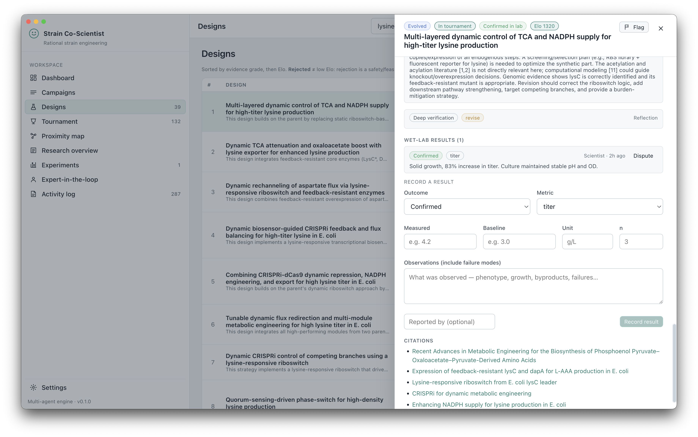

The **Experiments** view shows every recorded result alongside the predicted
value, a calibration scatter plot, and a signed-bias trend. The prediction
calibration panel on the Dashboard is also updated each cycle so agents learn to
predict better over time.

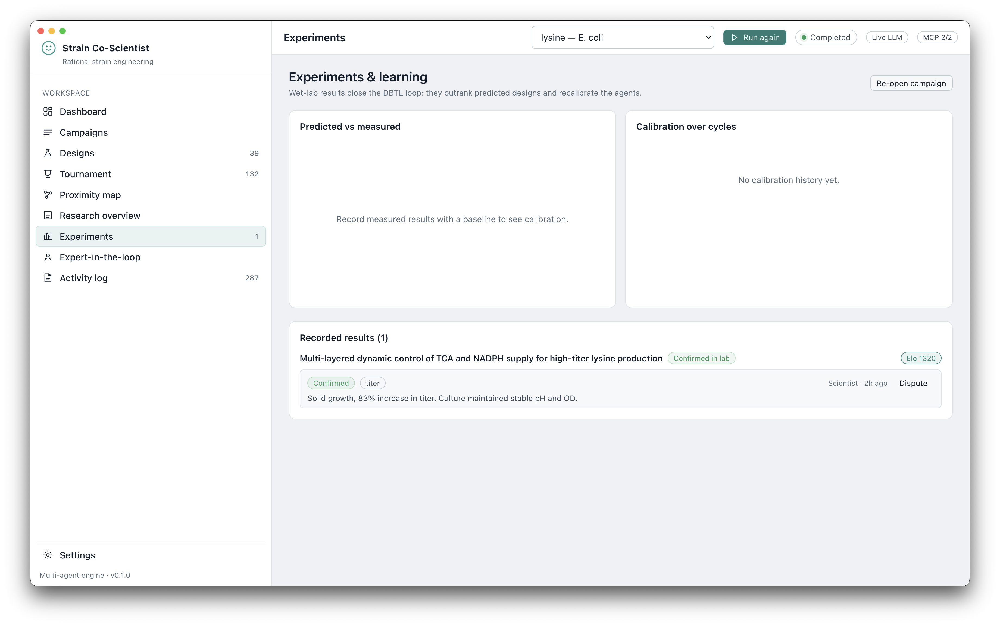

---

### Step 6 — Expert-in-the-loop controls

The **Expert-in-the-loop** surface gives you direct editorial control without
touching settings:

- **Refine goal** — amend the campaign objective mid-run
- **Contribute a design** — inject your own hypothesis as a first-class design
  that enters the tournament
- **Write a review** — add a manual expert review to any design
- **Flag for wet lab** — surface a design for prioritised experimental testing
- **Re-open a campaign** — restart a terminated campaign after recording new lab
  results, so the system reasons over fresh evidence

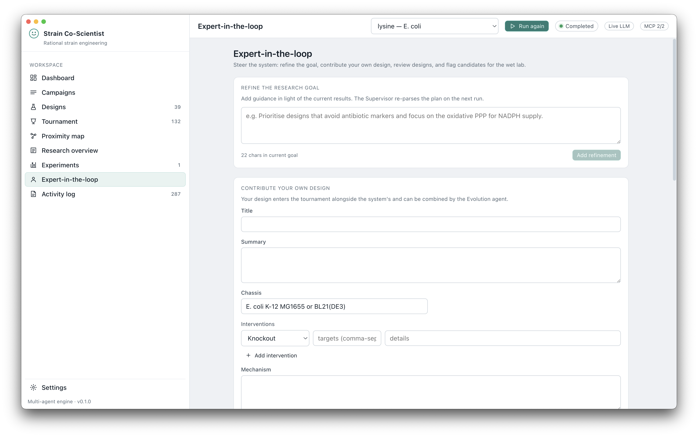

---

## The UI

A left-nav workstation shell with ten views:

| View | Purpose |
| --- | --- |
| **Dashboard** | Live system state: Elo-over-compute chart, prediction-calibration panel, design counts, agent utilization, strategy win-rates, worker queue, activity feed. |
| **Campaigns** | Create/configure campaigns (product, host, objective, constraints, compute budget) and control runs. |
| **Designs** | Evidence-then-Elo ranked, filterable table + detail drawer (interventions, mechanism, DBTL plan, constructs, reviews, wet-lab results, Elo sparkline, lineage). |
| **Tournament** | Match history with expandable scientific-debate transcripts. |
| **Proximity map** | d3-force cluster map of the explored design space. |
| **Research overview** | Meta-review roadmap, recurring critique patterns, suggested collaborators. |
| **Experiments** | Record/ dispute wet-lab results, predicted-vs-measured calibration scatter, signed-bias trend, per-intervention-class bias. |
| **Expert-in-the-loop** | Refine the goal, contribute your own design, write reviews, flag designs for the wet lab, record experimental results, re-open campaigns. |
| **Activity log** | Filterable structured event log. |
| **Settings** | LLM provider/models, MCP servers, engine, and safety configuration. |

## Repository layout

```
src/
  shared/        domain types, host presets, IPC contract (main <-> renderer)
  main/
    engine/      Supervisor, TaskQueue, agents/, tournament/, prompts/
    llm/         provider-agnostic client (Anthropic + OpenAI-compatible)
    mcp/         deep-research & CodeXomics MCP wrappers
    memory/      persistent context-memory store
    ipc/         typed ipcMain handlers
  preload/       contextBridge typed `window.api`
  renderer/      React UI (views/, components/, store/, styles/)
```

## Notes & scope

"Full functionality" here means the **complete architecture is operational
end-to-end** — all seven roles, the async queue, the Elo tournament, persistent
memory, MCP grounding, and the full monitoring UI — adapted for strain
engineering. Prompts are faithful adaptations of the paper's strategies rather
than a line-for-line reproduction of every supplementary-note prompt. The agents
require an Anthropic key; live literature/genomic grounding additionally requires
the user's deep-research and CodeXomics servers.
